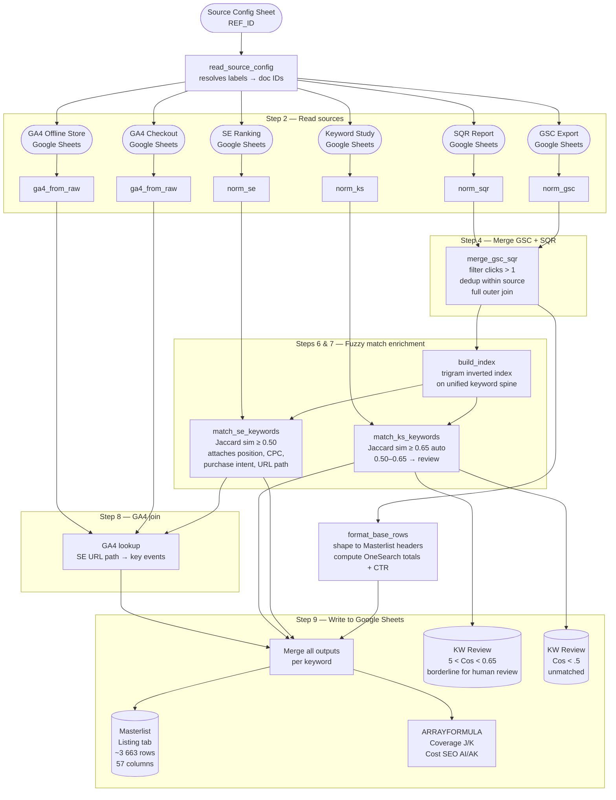
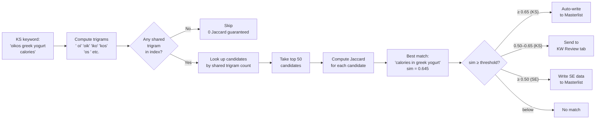
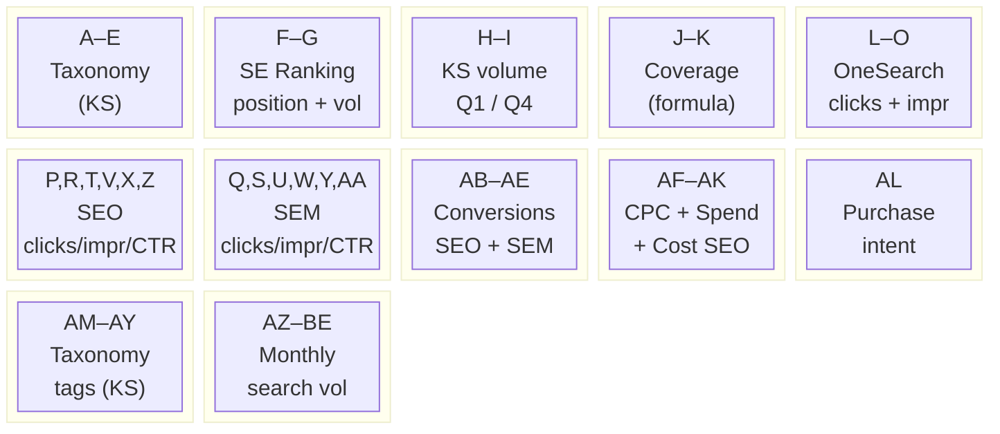

# OneSearch Pipeline

Google Sheets with Relevent Exports: https://docs.google.com/spreadsheets/d/1o526Qv4UzP_Qfe-cjrfvcA7jRUi6zUtd9Ecp2WPMIhQ/edit?gid=850184782#gid=850184782 

The OneSearch pipeline builds a unified keyword performance masterlist in Google Sheets. It answers the question: **for every keyword that drives traffic to the site — through organic search, paid search, or both — what does the full picture look like?**

It does this by pulling four data sources (Google Search Console, Google Ads, SE Ranking, and the internal Keyword Study), fuzzy-matching them all onto a single keyword spine, then writing a 57-column enriched masterlist to Google Sheets.

All computation runs locally in Python. No third-party packages required — stdlib only. Google Sheets is used only for reads (source data) and writes (results).

---

## Setup

**1. Clone the repo**

```bash
git clone git@github.com:Integral-Canada/one_search_danone_usa.git
cd one_search_danone_usa
```

**2. Create a `.env` file** in the repo root with the following variables:

```
GOOGLE_CLIENT_ID=your_client_id
GOOGLE_CLIENT_SECRET=your_client_secret
GOOGLE_REFRESH_TOKEN=your_refresh_token
SE_RANKING_API_KEY=your_se_ranking_api_key   # optional — required for volume enrichment
```

Google credentials come from an OAuth 2.0 client ID in Google Cloud Console with the Sheets API enabled. `SE_RANKING_API_KEY` is only needed for Step 10 (post-write volume enrichment); the pipeline completes without it.

**3. No install needed** — the pipeline uses Python 3 stdlib only.

---

## How to run

Open Terminal and run:

```bash
python3 run_onesearch.py
```

To test with a smaller batch first (faster, limits rows per source):

```bash
python3 run_onesearch.py --max-rows 500
```

The script prints progress to the terminal as it goes and prints a summary when done. It handles Google Sheets authentication automatically using the credentials in `.env`.

---

## What the pipeline does — step by step

### Step 1 — Read source config

The pipeline starts by reading a reference Google Sheet (`REF_ID`) that acts as a registry mapping source labels (like `"GSC Export"`) to the actual Google Sheet ID and tab name for that source. This means you never hardcode data IDs in the Python code — everything is configured in the sheet.

### Step 2 — Read all sources from Google Sheets

All source data is pulled from Google Sheets via the Sheets API. The sources are:

- **GSC Export** — Google Search Console, comparison mode: Q1 2026 vs Q4 2025. Gives actual organic search clicks, impressions, CTR, and average position for each query.
- **SQR Report** — Google Ads account-level search term report. Gives paid search clicks, impressions, cost, and search keyword for each search term.
- **SE Ranking** — Latest SE Ranking keyword export. Gives estimated search volume, current ranking position, CPC, and search intent.
- **Keyword Study** — Internal keyword taxonomy sheet. Gives topic, category, sub-category, brand classification, and monthly search volume.
- **GA4 Checkout** — GA4 page-level export filtered to `mikmak_checkout` events. Gives conversion counts per landing page for the checkout flow.
- **GA4 Offline Store** — Same as above filtered to `mikmak_click_offline_store` events. Gives conversion counts for store locator interactions.

### Step 3 — Normalize

Each source is cleaned and standardized into a common internal format. This step:
- Strips punctuation and lowercases keywords to create a normalized match key
- Handles two different number formats (NA style: `1,234` and French style: `32 395` / `135507,64`)
- Filters SE Ranking to position ≤ 100 only (keywords where Oikos ranks on page 1–10)
- Strips the domain from SE Ranking URLs (`https://www.oikos.com/all-products/triple-zero/` → `/all-products/triple-zero`) to create a path key used later for GA4 joining

### Step 4 — Merge GSC + SQR

GSC and SQR are joined into a single unified keyword list using a full outer join on the normalized keyword text. Before joining:
- Any keyword with ≤ 1 click in both periods is dropped (noise filter)
- Duplicate rows for the same keyword within each source are collapsed: clicks/impressions/cost are summed, position is impression-weighted averaged
- Keywords that appear in only GSC get SQR columns set to 0 (and vice versa)

This produces the **unified keyword spine** — roughly 3,663 unique keywords for Oikos USA.

### Step 5 — Build trigram index

A character trigram index is built on the unified keyword spine. Each keyword is broken into overlapping 3-character substrings (e.g. `"oikos"` → `[" oi", "oik", "iko", "kos", "os "]`), and an inverted index maps each trigram to the list of row positions where it appears.

This index is built **once** and reused by both the SE Ranking matcher and the Keyword Study matcher. It is the performance-critical component: instead of comparing every SE/KS keyword against every unified keyword (O(n×m)), the index allows the matcher to quickly find candidate matches by shared trigrams before computing full similarity.

### Step 6 — Match SE Ranking

Each SE Ranking keyword is compared against the unified keyword spine using Jaccard trigram similarity. For each SE keyword:
1. Compute its trigrams
2. Look up which unified rows share at least one trigram (candidates)
3. Compute full Jaccard similarity for each candidate
4. Keep the best match if similarity ≥ 0.50

This attaches SE Ranking data (position, search volume, CPC, purchase intent, URL path) to the matching unified row.

For any unified keyword that does not receive an SE Ranking match (col F blank), the pipeline falls back to the GSC average position for Q1 2026 (`gsc_pos_p1`), rounded to the nearest integer. This ensures maximum position coverage without SE Ranking gaps creating blind spots in col F.

### Step 7 — Match Keyword Study

The same index is used to match 14,273 Keyword Study keywords against the unified spine. The matching direction is deliberate: we iterate KS keywords through the small unified index (not the reverse) because the unified set is 11.5× smaller, which avoids an out-of-memory situation.

Matches are split at two thresholds:
- **≥ 0.65** — high confidence, auto-written to the Masterlist
- **0.50–0.65** — borderline, sent to the `5 < Cos < 0.65` review tab for human review
- **< 0.50** — unmatched, sent to the `Cos < .5` tab

### Step 8 — Attach GA4 conversions (pro-rata)

GA4 data is page-level (not keyword-level), so it can't be joined directly. The join uses SE Ranking as a bridge:
```
SE Ranking keyword → SE Ranking URL → strip domain → URL path → GA4 key events
```
When multiple keywords share the same SE landing page URL, the total conversion count for that page is distributed pro-rata by each keyword's Q1 SEO click share — rather than assigning the full total to every keyword. If no keyword on the page has SEO clicks, the conversions are split equally. This prevents double-counting when several keywords map to the same URL.

### Step 9 — Write to Masterlist

The pipeline:
1. Reads the Masterlist header row to get the exact column order
2. Expands the sheet if it doesn't have enough rows for all data
3. Clears rows 2+ in the Listing tab
4. Writes all merged rows in 500-row chunks
5. Clears and rewrites the two KW Review tabs
6. Writes four ARRAYFORMULA cells (Coverage J/K, Cost SEO AI/AK)

### Step 10 — SE Ranking API enrichment (post-write)

After writing to the Masterlist, the pipeline calls the SE Ranking API to fill in Average Search Volume (column G) for any row that still has G blank (i.e. keywords with OneSearch clicks but no Keyword Study match). The API looks up volume by keyword, computes a 6-month average, and writes directly to the G cells. Requires `SE_RANKING_API_KEY` in `.env`.

A log file is written to the `logs/` folder at the start of each run so you can review what happened after the fact.

---

## Diagrams

### Full pipeline flow



---

### How fuzzy matching works



---

### Column groups in the Masterlist



---

## Masterlist columns (A–BE)

Every column in the 57-column Masterlist, what it means, and where it comes from.

### Taxonomy (A–E) — from Keyword Study

These columns identify what each keyword is *about*. They are written when the KS fuzzy match has similarity ≥ 0.65.

| Col | Name | What it means |
|---|---|---|
| A | LANG | Language of the keyword. Always `EN` for Oikos USA. |
| B | Keyword | The display keyword — the original text from GSC or SQR, whichever was the primary source. |
| C | TOPICS | High-level topic from the Keyword Study (e.g. `PRODUCT`, `GENERIC`, `BRAND`). |
| D | CATEGORY | Mid-level category (e.g. `Yogurt`, `Brand`, `Competitor`). |
| E | SUB-CATEGORY | Most granular classification (e.g. `Greek yogurt`, `Oikos triple zero`, `Protein yogurt`). |

### SE Ranking signals (F–G)

| Col | Name | Source | What it means |
|---|---|---|---|
| F | Position SE Ranking | SE Ranking (trigram match ≥ 0.50) | The best organic ranking position currently held for this keyword. Only rows with position ≤ 100 are included. |
| G | Average Search Volume | Computed from KS; SE Ranking API fills gaps | Average monthly search volume across the 6-month window: `(Volume Q1 2026 + Volume Q4 2025) / 6`. For keywords without a Keyword Study match, the SE Ranking API is called post-write to fill in the value. Used as the denominator in the Coverage formula (J/K). |

### Keyword Study volume (H–I) — from Keyword Study

| Col | Name | What it means |
|---|---|---|
| H | Volume Q1 2026 | Sum of Jan + Feb + Mar 2026 monthly search volumes from the Keyword Study. Period-specific volume for the primary analysis window. |
| I | Volume Q4 2025 | Sum of Oct + Nov + Dec 2025 monthly search volumes from the Keyword Study. |

### Coverage (J–K) — ARRAYFORMULA

Coverage answers: **what share of estimated search demand is the brand capturing through clicks?**

Formula: `Clics OneSearch / Average Search Volume (G)`

| Col | Name | What it means |
|---|---|---|
| J | Coverage One Search Q1 2026 | Ratio of total clicks (SEO + SEM) in Q1 2026 to average monthly search volume. Format as % in the sheet. |
| K | Coverage One Search Q4 2025 | Same ratio for Q4 2025 clicks. |

A coverage rate > 1 is possible when paid volume significantly amplifies reach beyond organic demand.

### OneSearch combined (L–O) — GSC + SQR

Combined view of SEO and SEM performance together.

| Col | Name | What it means |
|---|---|---|
| L | Clics OneSearch Q1 2026 | Total clicks from SEO + SEM in Q1 2026 (`Clics SEO + Clics SEM`). |
| M | Impressions OneSearch Q1 2026 | Total impressions from SEO + SEM in Q1 2026. |
| N | Clics OneSearch Q4 2025 | Total clicks from SEO + SEM in Q4 2025. |
| O | Impressions OneSearch Q4 2025 | Total impressions from SEO + SEM in Q4 2025. |

### SEO performance (P, R, T, V, X, Z) — from GSC

Data from Google Search Console. Only keywords that generated > 1 organic click in either period appear.

| Col | Name | What it means |
|---|---|---|
| P | Clics SEO Q1 2026 | Organic search clicks in Q1 2026 (Jan–Mar). |
| R | Clics SEO Q4 2025 | Organic search clicks in Q4 2025 (Oct–Dec). |
| T | Impr. SEO Q1 2026 | Organic impressions in Q1 2026 — how often the site appeared in search results. |
| V | Impr. SEO Q4 2025 | Organic impressions in Q4 2025. |
| X | CTR SEO Q1 2026 | Organic click-through rate in Q1 2026 (`Clics / Impressions`). |
| Z | CTR SEO Q4 2025 | Organic click-through rate in Q4 2025. |

### SEM performance (Q, S, U, W, Y, AA) — from SQR

Data from the Google Ads search term report. Q4 2025 columns are currently blank because the SQR was exported for Q1 only.

| Col | Name | What it means |
|---|---|---|
| Q | Clics SEM Q1 2026 | Paid search clicks in Q1 2026. |
| S | Clics SEM Q4 2025 | Paid search clicks in Q4 2025. Blank until SQR re-exported with Q4 as comparison period. |
| U | Impr. SEM Q1 2026 | Paid impressions in Q1 2026. |
| W | Impr. SEM Q4 2025 | Paid impressions in Q4 2025. Blank — same reason as S. |
| Y | CTR SEM Q1 2026 | Paid click-through rate in Q1 2026. |
| AA | CTR SEM Q4 2025 | Paid click-through rate in Q4 2025. Blank — same reason. |

### Conversions (AB–AE) — from GA4 via SE Ranking URL

GA4 conversion events joined to keywords via the SE Ranking landing page URL. Only keywords where SE Ranking returned a URL will have conversions populated.

| Col | Name | What it means |
|---|---|---|
| AB | Conversions SEO Q1 2026 | Number of `mikmak_checkout` key events on the SE Ranking landing page in Q1 2026. Proxy for SEO-driven purchase intent. |
| AC | Conversions SEM Q1 2026 | Number of `mikmak_click_offline_store` events — users clicking to find a physical store. Proxy for SEM-driven offline intent. |
| AD | Conversions SEO Q4 2025 | Same as AB for Q4 2025. Blank until Q4 GA4 files are added to source config. |
| AE | Conversions SEM Q4 2025 | Same as AC for Q4 2025. Blank until Q4 GA4 files are added. |

### Cost and CPC (AF–AK)

| Col | Name | What it means |
|---|---|---|
| AF | CPC SEO Q1 2026 | Cost-per-click from SE Ranking for this keyword in Q1 2026. Represents the market rate for paid traffic on this keyword. |
| AG | CPC avg. SEM Q1 2026 | Average actual CPC paid in Google Ads in Q1 2026 (`Cost / Clicks`). |
| AH | Spent SEM Q1 2026 | Total Google Ads spend on this search term in Q1 2026. |
| AI | Cost SEO Q1 2026 | **ARRAYFORMULA** — estimated media value of organic traffic in Q1 2026: `CPC SEO (AF) × Clics SEO (P)`. Answers "what would these organic clicks have cost in paid search?" |
| AJ | Spent SEM Q4 2025 | Total Google Ads spend in Q4 2025. Blank until SQR re-exported with Q4 comparison. |
| AK | Cost SEO Q4 2025 | **ARRAYFORMULA** — same as AI but using Q4 clicks: `CPC SEO (AF) × Clics SEO Q4 (R)`. |

### Purchase intent (AL) — from SE Ranking

| Col | Name | What it means |
|---|---|---|
| AL | Purchase intent | SE Ranking's search intent classification. Labels: `C` = Commercial, `I` = Informational, `N` = Navigational, `L` = Local. A keyword can have multiple labels (e.g. `C, I`). |

### Taxonomy tags (AM–AY) — from Keyword Study (advanced)

These columns require a richer Keyword Study format with tag columns. The current KS only has TOPIC/CATEGORY/SUB-CATEGORY, so these are blank until a taxonomy-enriched KS is provided.

| Col | Name | What it means |
|---|---|---|
| AM | Questions | Keywords phrased as questions. |
| AN | Yogurt types | Type of yogurt referenced (e.g. Greek, skyr, drinkable). |
| AO | Taste | Taste profile (e.g. vanilla, strawberry, plain). |
| AP | Packaging | Package type or size (e.g. single serve, multipack). |
| AQ | Ingredient | Key ingredient referenced (e.g. protein, probiotics). |
| AR | Brands | Brand name in the keyword. |
| AS | Retailer | Retail channel (e.g. Walmart, Target). |
| AT | Demography | Audience demographic signal (e.g. kids, seniors). |
| AU | Benefits | Functional benefit (e.g. high protein, low sugar). |
| AV | Testimonials | User review or testimonial-style queries. |
| AW | Bio | Bio/organic product mentions. |
| AX | Moments | Consumption moment (e.g. breakfast, post-workout). |
| AY | Recipes | Recipe-related queries. |

### Monthly search volumes (AZ–BE) — from Keyword Study

Monthly search volumes from the Keyword Study for the 6-month window spanning the two analysis periods.

| Col | Name |
|---|---|
| AZ | Searches: Oct 2025 |
| BA | Searches: Nov 2025 |
| BB | Searches: Dec 2025 |
| BC | Searches: Jan 2026 |
| BD | Searches: Feb 2026 |
| BE | Searches: Mar 2026 |

---

## Module reference

### `run_onesearch.py` — entry point

Orchestrates the full pipeline. Reads all sources, runs modules in order, writes to Google Sheets.

| Function | Does |
|---|---|
| `load_env()` | Reads `.env` file for Google OAuth credentials |
| `get_token(env)` | Exchanges refresh token for a short-lived access token via OAuth2 |
| `get_sheet_gid(token, spreadsheet_id, tab_name)` | Returns the integer sheet ID (gid) and current row count for a named tab — used before expanding |
| `expand_sheet_rows(token, spreadsheet_id, gid, extra_rows)` | Expands the grid capacity of a sheet tab via `appendDimension` batchUpdate when the incoming data exceeds the current row count. **Does not append data** — data is always replaced from row 2 via `sheets_clear` + `sheets_batch_update`. |
| `sheets_get(token, sheet_id, range_)` | GET a range from the Sheets API → list of lists |
| `sheets_clear(token, sheet_id, range_)` | Clear a range before rewriting |
| `sheets_batch_update(token, sheet_id, data_ranges)` | Write multiple ranges in one API call. Retries up to 5× with backoff on HTTP errors. |
| `raw_to_dicts(raw_rows)` | Converts list-of-lists (first row = headers) → list of dicts |
| `read_source_config(token)` | Reads the reference sheet → `{export_label: {doc_id, sheet_tab}}` |
| `build_row(data_dict, headers)` | Serializes one merged row to a flat list aligned to the Masterlist column order |
| `main()` | Full pipeline: auth → read sources → normalize → merge → index → match → merge outputs → write → SE API enrichment |

A timestamped log file is created at the start of each run in `logs/onesearch_YYYY-MM-DD_HH-MM-SS.log`. All output that prints to the terminal is also saved there.

---

### `pipeline/normalize.py`

Text and number normalization used throughout the pipeline.

| Function | Input → Output | Notes |
|---|---|---|
| `normalize(s)` | `"Oikos Greek Yogurt!"` → `"oikos greek yogurt"` | Lowercase, strip punctuation and zero-width spaces, collapse whitespace. The canonical key used for all fuzzy matching. |
| `clean_num(v)` | `"32 395"` → `32395.0` or `"135507,64"` → `135507.64` | Handles both NA format (comma = thousands) and French format (space = thousands, comma = decimal). |
| `parse_pct(v)` | `"12.5%"` → `0.125` | Strips `%` and divides by 100. |

---

### `pipeline/ingest.py`

Normalizes raw rows from each source into standard internal field names.

| Function | Produces | Key logic |
|---|---|---|
| `norm_gsc(rows)` | `norm_query`, `gsc_clicks_p1/p2`, `gsc_impr_p1/p2`, `gsc_ctr_p1/p2`, `gsc_pos_p1/p2` | Drops rows where both periods have 0 clicks. P1 = Q1 2026, P2 = Q4 2025. |
| `norm_sqr(rows)` | `norm_term`, `sqr_clicks_p1/p2`, `sqr_cost_p1/p2`, `sqr_impr_p1/p2` | Handles French number format. P2 is zero if SQR was not exported with a comparison period. |
| `norm_ks(rows)` | `norm_keyword`, `lang`, `topic`, `category`, `sub_category`, monthly volumes, taxonomy fields | All taxonomy fields default to `''` if not present in the KS sheet. |
| `norm_se(rows)` | `norm_se_keyword`, `se_position`, `se_search_vol`, `se_cpc`, `se_search_intent`, `se_url_path` | Filters to position ≤ 100. Strips `https://www.domain.com` prefix from URL column to produce path only. |

---

### `pipeline/ingest_ga4.py`

Parses GA4 page-level exports → `{url_path: key_events}` lookup dict.

GA4 exports have 9 metadata rows before the data header. The functions scan for the header row by looking for known column names rather than assuming a fixed row number.

| Function | Does |
|---|---|
| `ga4_from_raw(raw_values)` | Sheets API list-of-lists → `{path: events}` dict. Finds the header row, then accumulates key events per URL path. |
| `norm_ga4_rows(rows)` | List-of-dicts → `{path: events}` dict. Used when data is already in dict form. |

Paths are normalized by stripping trailing slashes so `/all-products/triple-zero/` and `/all-products/triple-zero` match the same key.

---

### `pipeline/merge.py`

Full outer join of GSC and SQR on normalized keyword.

| Function | Does |
|---|---|
| `merge_gsc_sqr(gsc_rows, sqr_rows)` | Filter (clicks > 1) → dedup GSC (sum + weighted position) → dedup SQR (sum + concat keyword list) → full outer join. Returns unified rows where GSC-only rows have SQR fields = 0 and vice versa. |

The click threshold is `> 1`, not `> 0`, to eliminate single-click noise while preserving genuine low-traffic keywords.

---

### `pipeline/format_rows.py`

Shapes unified rows into the Masterlist column structure for the base write.

| Function | Does |
|---|---|
| `format_base_rows(unified)` | Maps internal field names to Masterlist headers. Computes OneSearch totals (SEO + SEM), CTR percentages (`clicks / impressions`), and SEM CPC average (`cost / clicks`). Returns `''` for any zero value so cells stay visually blank. |

---

### `pipeline/trigram.py`

Character n-gram index and Jaccard similarity — the core of fuzzy matching.

| Function | Does |
|---|---|
| `trigrams_arr(s)` | Pads string with spaces, extracts all unique 3-character substrings in order. e.g. `"oikos"` → `[" oi", "oik", "iko", "kos", "os "]` |
| `jaccard(u_arr, q_set)` | `intersection / union` on two trigram sets. Returns a float 0–1. |
| `build_index(unified_rows)` | Builds the inverted trigram index on the unified keyword spine. Returns `{uKeys, uDisplay, uTg, idx}` where `idx` maps each trigram → list of row positions. Built once, reused by both matchers. |

---

### `pipeline/match_se.py`

Matches SE Ranking keywords to Masterlist rows.

| Function | Threshold | Output fields |
|---|---|---|
| `match_se_keywords(se_rows, index)` | sim ≥ 0.50 | `Position SE Ranking`, `CPC SEO Q1 2026`, `Purchase intent`, `_se_url_path` (internal, used for GA4 join) |

One SE Ranking keyword → one best match per unified row. If multiple SE keywords match the same unified row, only the highest-similarity one is kept.

---

### `pipeline/match_ks.py`

Matches Keyword Study keywords to Masterlist rows.

Matching direction: index is built on the ~3,663 small unified rows, and the 14,273 KS keywords are iterated through it — not the reverse. Building the index on 14,273 KS rows caused out-of-memory errors; the unified index is 11.5× smaller.

Performance optimizations:
- **Lossless pre-filter**: any KS keyword with zero shared trigrams with the entire index is skipped immediately (Jaccard would be 0 anyway)
- **Top-50 candidate cap**: for each KS keyword, only the 50 unified rows with the most shared trigrams are Jaccard-scored; the best match is almost always in this set

| Function | Threshold | Returns |
|---|---|---|
| `match_ks_keywords(ks_rows, index, unified)` | ≥ 0.65 auto / 0.50–0.65 review | `(high_conf_rows, review_rows)` — two separate lists |

High-confidence rows output: `LANG`, `TOPICS`, `CATEGORY`, `SUB-CATEGORY`, `Volume Q1/Q4 2026`, taxonomy tags, monthly search columns.

---

### `pipeline/enrich.py`

Post-pipeline enrichment that runs after the Masterlist is written. Currently one active step:

| Function | Does |
|---|---|
| `enrich_volumes(token, master_id, master_tab, ser_api_key)` | Reads all Masterlist rows that have OneSearch clicks but blank Average Search Volume (G). Calls the SE Ranking API in batches of 500 keywords. Computes `avg = round(sum(6_monthly_volumes) / 6)` per keyword and writes the result to column G. Requires `SE_RANKING_API_KEY` in `.env`. |

The SE Ranking API endpoint used: `POST https://api.seranking.com/v1/keywords/export?source=us`

---

## Similarity thresholds

| Similarity | Action | Written to |
|---|---|---|
| ≥ 0.65 | Auto-match: KS data written to Masterlist | `Listing` tab |
| 0.50 – 0.65 | Borderline: sent for human review | `5 < Cos < 0.65` tab |
| < 0.50 | No match | `Cos < .5` tab |

SE Ranking matching uses a separate threshold of **0.60** (raised from 0.50 to reduce false positives on short keywords).

The review tabs (`5 < Cos < 0.65` and `Cos < .5`) include suggested matches and similarity scores. A human can approve borderline matches by marking `approved = YES`, then re-run the pipeline to write the approved KS data to the Masterlist.

SE Ranking uses a lower threshold (0.60) than KS because SE keyword text is more standardized and exact, so lower similarity still represents a genuine match. The threshold was raised from 0.50 to 0.60 to eliminate false positives on short or generic keywords that were silently corrupting position data in the Masterlist.

---

## Current Oikos USA config

| Setting | Value |
|---|---|
| Client | Oikos USA |
| Period 1 | Q1 2026 (Jan 1 – Mar 31, 2026) |
| Period 2 | Q4 2025 (Oct 1 – Dec 31, 2025) |
| Masterlist Sheet ID | `1W73Lzli30z4GnO_WtLjs0hWOdPcEZw1jptXKG8exKoU` |
| Source config Sheet ID | `1o526Qv4UzP_Qfe-cjrfvcA7jRUi6zUtd9Ecp2WPMIhQ` |
| Source config tab | `One Search ` *(trailing space is intentional — matches actual sheet tab name)* |
| Keyword Study Sheet ID | `1kiOgeo5J66tAngETUGVv1CFX072g4rnDiWKLf6KP7co` |
| KS tab | `Keyword study US` |

---

## Columns that still need source data

| Column(s) | Why blank | How to fix |
|---|---|---|
| S, W, AA, AJ — SEM Q4 clicks / impressions / CTR / spend | SQR was exported for Q1 only. The `Clicks (Compare to)` column is 0 for every row. | Re-export the SQR from Google Ads with Q4 2025 (Oct 1 – Dec 31, 2025) selected as the comparison date range. Paste into the source sheet. |
| AD, AE — Conversions Q4 2025 | No Q4 GA4 files are in the source config. | Export Q4 2025 GA4 data (same format as Q1 files) and add two rows to the source config sheet: `Conversions: Checkout Q4 2025` and `Conversions: Click Offline Store Q4 2025`. |
| AM–AY — taxonomy tag columns | The current Keyword Study only has `TOPIC`, `CATEGORY`, `SUB-CATEGORY`. The tag columns (`Yogurt types`, `Taste`, etc.) are absent. | Provide a Keyword Study export that includes the full taxonomy dimension columns (`Yogurt types`, `Taste`, `Packaging`, `Ingredient`, `Brands`, `Retailer`, `Demography`, `Benefits`, `Testimonials`, `Bio`, `Moments`, `Recipes`). |

---

## Adding a new client

To run the pipeline for a new client:

1. Add a new row block in the source config sheet (`REF_ID`, tab `One Search `) with the client's export labels and sheet IDs
2. Update the constants at the top of `run_onesearch.py`:
   - `MASTER_ID` — the client's Masterlist sheet ID
   - `MASTER_TAB` — the Listing tab name
   - `CLIENT_LANG` — default language for rows with no KS LANG value (e.g. `"EN"`, `"FR"`)
3. Ensure the Masterlist has a header row in row 1 with the correct 57-column names
4. Run `python3 run_onesearch.py`

The script reads column order from the live header row, so no code changes are needed as long as column names match.

**Multi-language clients:** Set `CLIENT_LANG` to the client's primary market language. For bilingual clients (e.g. Danone Canada EN/FR), the Keyword Study's `LANG` column drives language per keyword — `CLIENT_LANG` only applies to keywords that have no KS match. Trigram matching is language-agnostic and handles mixed-language keyword sets automatically.
