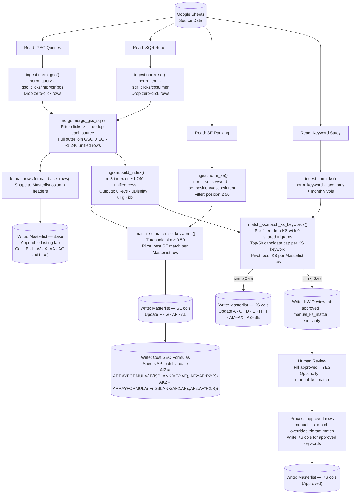

# OneSearch Pipeline — Architecture Reference

> Last updated: Apr 2026 (v5→Python). Computation runs in the `one_search/` Python package; Google Sheets is used only for reads and writes via the Sheets API.

---

## Pipeline Overview

**Entry point:** `run_onesearch.py` (built and operational — Apr 2026)

**Input Phase:** Read source data from Google Sheets
- Read Keyword Study → `ingest.norm_ks()`
- Read GSC Queries → `ingest.norm_gsc()`
- Read SQR Report → `ingest.norm_sqr()`
- Read SE Ranking → `ingest.norm_se()` (pre-filters to position ≤ 100)

**Merge Phase:** Combine GSC + SQR into unified base rows
- `merge.merge_gsc_sqr()` — filter (clicks > 1), dedup, full outer join
- `format_rows.format_base_rows()` — shape to Masterlist column headers
- Write base rows to Listing tab (append)

**SE Enrichment:** Match SE Ranking to Masterlist rows
- `trigram.build_index()` — build n=3 index once on ~1,240 unified rows
- `match_se.match_se_keywords()` — iterate SE rows, threshold sim ≥ 0.50
- Write SE cols (F G AF AL) to Masterlist (update by Keyword)
- Write Cost SEO formulas (AI2, AK2 as ARRAYFORMULA) via Sheets API

**KS Enrichment:** Match Keyword Study to Masterlist rows
- `match_ks.match_ks_keywords()` — iterate 14,273 KS keywords, reuse index
  - Sim ≥ 0.65 → write KS cols (A C D E H I AM–AX AZ–BE) to Masterlist
  - Sim < 0.65 → write to KW Review tab for human approval

**Human-in-the-Loop:**
- Human opens KW Review tab, fills `approved` = YES
- Script reads approved rows and writes KS cols for those keywords

---

## Complexity Analysis

Let: Q = unified queries (~1,240) · K = KS keywords (14,273) · R = SE Ranking rows · t = avg trigrams per string (~10)

| | Option 1: index on KS | Option 2: index on unified ✅ SELECTED |
|---|---|---|
| **Index built on** | 14,273 KS keywords | ~1,240 unified queries |
| **Index size (space)** | O(K × t) ≈ 143K entries — large | O(Q × t) ≈ 12.4K entries — **~11.5× smaller** |
| **Index build time** | O(K × t) — slow | O(Q × t) — **~11.5× faster** |
| **Match iterations** | Q × candidates from large index | K × candidates from small index + O(K) pivot |
| **Memory risk** | HIGH | LOW — tiny index |
| **Extra step** | None | O(K) pivot: group by unified query, keep best KS |

**Why Option 2:** The index is the memory hog. Building on ~1,240 unified queries is ~11.5× smaller than building on 14,273 KS keywords. The O(K) pivot is a single-pass loop — trivial. Same final result.

---

## Pipeline Architecture



---

## Python Module Reference (`one_search/`)

| Module | Key functions | Purpose |
|---|---|---|
| `normalize.py` | `normalize()`, `clean_num()`, `parse_pct()` | Shared text/number normalization |
| `trigram.py` | `trigrams_arr()`, `jaccard()`, `build_index()` | n=3 trigram index + Jaccard similarity |
| `ingest.py` | `norm_gsc()`, `norm_sqr()`, `norm_ks()`, `norm_se()` | Raw sheet rows → standard field names |
| `merge.py` | `merge_gsc_sqr()` | Filter, dedup, full outer join GSC ∪ SQR |
| `format_rows.py` | `format_base_rows()` | Unified rows → Masterlist column headers |
| `match_se.py` | `match_se_keywords()` | SE Ranking → Masterlist (sim ≥ 0.50) |
| `match_ks.py` | `match_ks_keywords()` | KS → Masterlist (split at sim ≥ 0.65) |

---

## Normalization — Field Name Map

### Keyword Study → `norm_ks()`

| Input col | Output field |
|---|---|
| `Keyword` | `norm_keyword` (normalized), `keyword` (raw) |
| `LANG` | `lang` |
| `TOPIC` | `topic` |
| `CATEGORY` | `category` |
| `SUB-CATEGORY` | `sub_category` |
| `Searches: Oct 2025` … `Searches: Mar 2026` | Same names — passed through |

### GSC → `norm_gsc()`

| Input col | Output field |
|---|---|
| `Top queries` | `norm_query` (normalized), `query` (raw) |
| `1/1/26 - 3/31/26 Clicks` | `gsc_clicks_p1` |
| `10/1/25 - 12/31/25 Clicks` | `gsc_clicks_p2` |
| `1/1/26 - 3/31/26 Impressions` | `gsc_impr_p1` |
| `10/1/25 - 12/31/25 Impressions` | `gsc_impr_p2` |
| `1/1/26 - 3/31/26 CTR` | `gsc_ctr_p1` |
| `10/1/25 - 12/31/25 CTR` | `gsc_ctr_p2` |
| `1/1/26 - 3/31/26 Position` | `gsc_pos_p1` |
| `10/1/25 - 12/31/25 Position` | `gsc_pos_p2` |

### SQR → `norm_sqr()`

| Input col | Output field |
|---|---|
| `Search term` | `norm_term` (normalized), `search_term` (raw) |
| `Search keyword` | `search_keyword` |
| `Clicks` | `sqr_clicks_p1` |
| `Clicks (Compare to)` | `sqr_clicks_p2` |
| `Cost` | `sqr_cost_p1` |
| `Cost (Compare to)` | `sqr_cost_p2` |
| `Impr.` | `sqr_impr_p1` |
| `Impr. (Compare to)` | `sqr_impr_p2` |

### SE Ranking → `norm_se()`

| Input col | Output field |
|---|---|
| `Keyword` (BOM-safe) | `norm_se_keyword` (normalized), `se_keyword` (raw) |
| `Position` | `se_position` |
| `Search vol.` | `se_search_vol` |
| `CPC` | `se_cpc` |
| `Search intent` | `se_search_intent` |

---

## Merge: `merge_gsc_sqr()` — Logic

1. **Filter GSC**: keep rows where `gsc_clicks_p1 > 1 OR gsc_clicks_p2 > 1`
2. **Filter SQR**: keep rows where `sqr_clicks_p1 > 1 OR sqr_clicks_p2 > 1`
3. **Dedup GSC** by `norm_query`: SUM clicks + impr; weighted-avg position; recompute CTR = sumClicks / sumImpr
4. **Dedup SQR** by `norm_term`: SUM clicks + cost + impr; concat unique `search_keyword` values with ` | `
5. **Full outer join** GSC ∪ SQR on normalized keyword:
   - Matched rows: all GSC + SQR cols
   - GSC-only rows: SQR numeric cols = 0, `search_term` = `''`
   - SQR-only rows: GSC numeric cols = 0, `query` = `''`
   - Join key stored as `unified_key`

---

## Trigram Match — Thresholds

| Similarity | Bucket | Destination |
|---|---|---|
| ≥ 0.65 | High confidence | Write to Masterlist (automatic) |
| 0.50–0.65 | Borderline | KW Review sheet (human approval) |
| < 0.50 | Unmatched | KW Review sheet (human approval) |

---

## Column Join Key Map (Masterlist — Listing tab)

| Masterlist Col | Label in sheet | Source | Join path | Exact source field |
|---|---|---|---|---|
| A | LANG | Keyword Study | anchor | `lang` |
| B | Keyword | Keyword Study | anchor | `keyword` |
| C | TOPICS | Keyword Study | anchor | `topic` |
| D | CATEGORY | Keyword Study | anchor | `category` |
| E | SUB-CATEGORY | Keyword Study | anchor | `sub_category` |
| F | Position SE Ranking | SE Ranking | trigram → KS | `se_position` |
| G | Average Search Volume | SE Ranking | trigram → KS | `se_search_vol` |
| H | Volume Q1 2026 | Keyword Study | anchor | sum Jan+Feb+Mar 2026 |
| I | Volume Q4 2025 | Keyword Study | anchor | sum Oct+Nov+Dec 2025 |
| J | Coverage One Search Q1 2026 | Sheet formula | — | **SKIP — do not write** |
| K | Coverage One Search Q4 2025 | Sheet formula | — | **SKIP — do not write** |
| L | Clics OneSearch Q1 2026 | Computed | — | SEO Clicks P1 + SEM Clicks P1 |
| M | Impressions OneSearch Q1 2026 | Computed | — | SEO Impr P1 + SEM Impr P1 |
| N | Clics OneSearch Q4 2025 | Computed | — | SEO Clicks P2 + SEM Clicks P2 |
| O | Impressions OneSearch Q4 2025 | Computed | — | SEO Impr P2 + SEM Impr P2 |
| P | Clics SEO Q1 2026 | GSC | unified → KS | `gsc_clicks_p1` |
| Q | Clics SEM Q1 2026 | SQR | unified → KS | `sqr_clicks_p1` |
| R | Clics SEO Q4 2025 | GSC | unified → KS | `gsc_clicks_p2` |
| S | Clics SEM Q4 2025 | SQR | unified → KS | `sqr_clicks_p2` |
| T | Impr. SEO Q1 2026 | GSC | unified → KS | `gsc_impr_p1` |
| U | Impr. SEM Q1 2026 | SQR | unified → KS | `sqr_impr_p1` |
| V | Impr. SEO Q4 2025 | GSC | unified → KS | `gsc_impr_p2` |
| W | Impr. SEM Q4 2025 | SQR | unified → KS | `sqr_impr_p2` |
| X | CTR SEO Q1 2026 | Computed | — | gsc_clicks_p1 / gsc_impr_p1 |
| Y | CTR SEM Q1 2026 | Computed | — | sqr_clicks_p1 / sqr_impr_p1 |
| Z | CTR SEO Q4 2025 | Computed | — | gsc_clicks_p2 / gsc_impr_p2 |
| AA | CTR SEM Q4 2025 | Computed | — | sqr_clicks_p2 / sqr_impr_p2 |
| AB | Conversions SEO Q1 2026 | GA4 (TBD) | — | **leave blank** |
| AC | Conversions SEM Q1 2026 | Google Ads export (TBD) | — | **leave blank** |
| AD | Conversions SEO Q4 2025 | GA4 (TBD) | — | **leave blank** |
| AE | Conversions SEM Q4 2025 | Google Ads export (TBD) | — | **leave blank** |
| AF | CPC SEO Q1 2026 | SE Ranking | trigram → unified | `se_cpc` (market estimate) |
| AG | CPC avg. SEM Q1 2026 | Computed | — | `sqr_cost_p1 / sqr_clicks_p1` |
| AH | Spent SEM Q1 2026 | SQR | unified | `sqr_cost_p1` |
| AI | Cost SEO Q1 2026 | ⚠️ Computed | — | `se_cpc × gsc_clicks_p1` — verify before deploying |
| AJ | Spent SEM Q4 2025 | SQR | unified | `sqr_cost_p2` |
| AK | Cost SEO Q4 2025 | ⚠️ Computed | — | `se_cpc × gsc_clicks_p2` — verify before deploying |
| AL | Purchase intent | SE Ranking | trigram → unified | `se_search_intent` |
| AM | Yogurt types | Keyword Study | trigram → unified | KS taxonomy col |
| AN | Taste | Keyword Study | trigram → unified | KS taxonomy col |
| AO | Packaging | Keyword Study | trigram → unified | KS taxonomy col |
| AP | Ingredient | Keyword Study | trigram → unified | KS taxonomy col |
| AQ | Brands | Keyword Study | trigram → unified | KS taxonomy col |
| AR | Retailer | Keyword Study | trigram → unified | KS taxonomy col |
| AS | Demography | Keyword Study | trigram → unified | KS taxonomy col |
| AT | Benefits | Keyword Study | trigram → unified | KS taxonomy col |
| AU | Testimonials | Keyword Study | trigram → unified | KS taxonomy col |
| AV | Bio | Keyword Study | trigram → unified | KS taxonomy col |
| AW | Moments | Keyword Study | trigram → unified | KS taxonomy col |
| AX | Recipes | Keyword Study | trigram → unified | KS taxonomy col |
| AY | *(unused)* | — | — | gap col — not written |
| AZ | Searches: Oct 2025 | Keyword Study | trigram → unified | Monthly vol col |
| BA | Searches: Nov 2025 | Keyword Study | trigram → unified | Monthly vol col |
| BB | Searches: Dec 2025 | Keyword Study | trigram → unified | Monthly vol col |
| BC | Searches: Jan 2026 | Keyword Study | trigram → unified | Monthly vol col |
| BD | Searches: Feb 2026 | Keyword Study | trigram → unified | Monthly vol col |
| BE | Searches: Mar 2026 | Keyword Study | trigram → unified | Monthly vol col |

---

## Human-in-the-Loop Approval — Procedure

1. High-confidence rows (≥ 0.65) are written to Masterlist automatically.
2. Borderline + unmatched rows are written to the **KW Review tab** of the Masterlist sheet.
3. Open the KW Review tab. For each keyword to include, type `YES` in the `approved` column. Optionally fill `manual_ks_match` with the correct KS keyword.
4. Run the script again (or call the approved-keywords function directly) to write KS cols for approved rows.

---

## Pre-Run Checklist

- [ ] Clear rows 2+ of the Listing tab before re-running (or dedup by keyword after)
- [ ] Clear the KW Review tab before re-running
- [ ] Confirm Keyword Study tab has columns: `Searches: Oct 2025` through `Searches: Mar 2026`
- [ ] Confirm GSC date-range column names match exactly: `1/1/26 - 3/31/26 Clicks`, `10/1/25 - 12/31/25 Clicks`, etc.
- [ ] Coverage cols J–K are formula cols — the script does NOT write to them (correct)

---

## Open Gaps

| Item | Status |
|---|---|
| Q4 SEM data (cols S, W, AA, AJ) | Blank — SQR was exported for Q1 only; re-export with Q4 as comparison period |
| Conversions Q1 SEO/SEM (AB, AC) | Connected — GA4 checkout (67 pages) and offline store (1 page) for Q1 2026 |
| Conversions Q4 SEO/SEM (AD, AE) | Not configured — Q4 GA4 files not added to source config |
| SE Ranking threshold | Currently 0.50 — review report recommends raising to 0.60 |
| SE Ranking position fallback | No GSC fallback for blank col F — report recommends using GSC avg position if SE Ranking has no match |
| PMax filter in SQR | `norm_sqr()` does not filter by campaign type; Performance Max spend not excluded |
| Quality Score (QS) | `quality_report_oikos.csv` is read but not processed or written to Masterlist |
| CPC SEO label | `se_cpc` is a market estimate from SE Ranking, not actual paid CPC |

---

## Trigram Index — How It Works

```
normalize("yogurt") → "yogurt"
trigrams("yogurt") → {" yo", "yog", "ogu", "gur", "urt", "rt "}

Jaccard(A, B) = |A ∩ B| / |A ∪ B|

Threshold ≥ 0.65 → high confidence (auto-Masterlist)
Threshold 0.50–0.65 → borderline (KW Review)
Threshold < 0.50 → unmatched (KW Review)
```

**Index is built on the ~1,240 unified GSC+SQR queries (NOT on KS keywords).**
- Building on KS (14,273 rows) produced an ~11.5× larger index and caused OOM crashes.
- Both KS keywords (14,273) and SE Ranking keywords are iterated through this small unified index.
- After iteration: pivot results back to unified queries (group by query, keep highest-similarity KS match).
- Index is built once and reused for both SE and KS matching.
